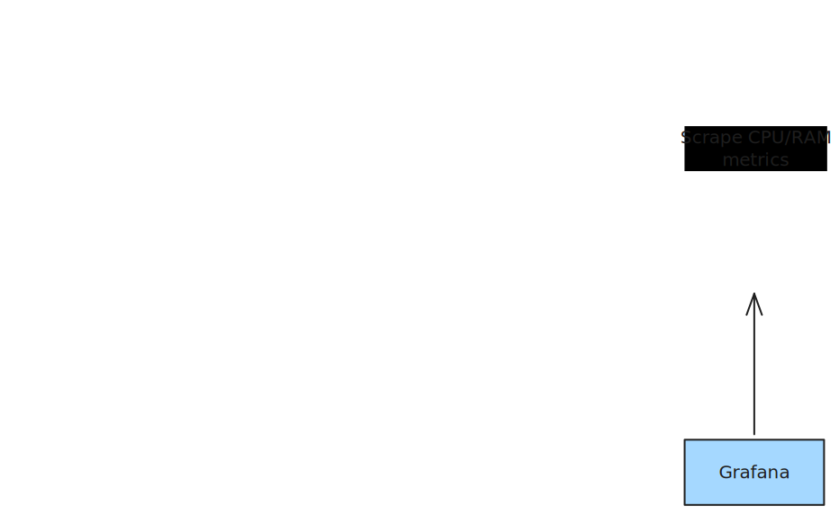

# Log Collectors Benchmark

A benchmark suite for comparing log collectors, with log delivery verification.

Beyond performance numbers, this tool continuously verifies that every log record is delivered without losses.
At VictoriaMetrics, we use it to ensure vlagent reliably delivers logs under any load.

## Results

TBA

## Overview

Tested collectors:

- [VictoriaLogs Agent](https://docs.victoriametrics.com/victorialogs/vlagent/) (vlagent) v1.48.0
- [Vector](https://vector.dev/) v0.53.0
- [Promtail](https://grafana.com/docs/loki/latest/send-data/promtail/) v3.5.1
- [Grafana Alloy](https://grafana.com/docs/alloy/latest/) v1.13.2
- [Grafana Agent](https://grafana.com/docs/agent/latest/) v0.44.2
- [Fluent Bit](https://fluentbit.io/) v4.2.3
- [OpenTelemetry Collector](https://opentelemetry.io/docs/collector/) v0.146.1
- [Filebeat](https://www.elastic.co/beats/filebeat) v9.3.1
- [Fluentd](https://www.fluentd.org/) v1.19.1

Runs in a local k8s cluster (using `kind`).

What is measured:

- CPU and memory usage per collector.
- Throughput.
- Missing logs.

Collectors are configured to compress request bodies to reduce network traffic
and better emulate production environments.
Different collectors use different compression algorithms (gzip, snappy, zstd)
and protocols (JSON, protobuf), which can impact performance.

Configurations are based on official Helm chart defaults with
minimal modifications required for the benchmark environment.
No heavy tuning is applied to ensure fair comparison, including:

- No custom buffer sizes or queue depths.
- No custom batch sizes or flush intervals.
- No additional worker threads or parallelism settings.
- No runtime tuning such as garbage collection settings.

All collectors have identical resource requests and limits (1 CPU, 1 GiB memory) for fair comparison
and reduce the chance of CPU/RAM contention when running multiple collectors simultaneously.

Since it's challenging to configure all collectors to use identical log formats,
each collector may produce different output formats.

## How does it work?

1. log-generator - generates JSON logs.
2. Log collector - tails logs from log-generator Pods, ships to log-verifier.
3. log-verifier - receives logs directly from collectors, exposes delivery metrics.
4. VictoriaMetrics - stores metrics; vmagent - collects CPU/RAM metrics of containers and metrics from log-verifier.
5. Grafana - displays metrics and resource usage.

Simplified diagram:



### Verification

log-verifier implements a VictoriaLogs-compatible insert API,
so collectors ship logs directly to it without any additional configuration.

Each log produced by log-generator contains:

- `sequence_id` - a unique, monotonically increasing integer per Pod.
- `generated_at` - nanosecond timestamp of when the log was produced.

For each collector + Pod pair, log-verifier tracks:

- The maximum observed `sequence_id` (`log_verifier_max_sequence_id`).
- Total number of received logs (`log_verifier_logs_total`).
- End-to-end delivery latency (difference between `generated_at` and the time log-verifier received the log).

Since `sequence_id` starts at 1 and increments strictly by 1 for each log, the number of lost logs is:

```
sum(log_verifier_max_sequence_id - log_verifier_logs_total) by (collector)
```

> Note: The formula is valid as long as log-generator Pods are not restarted with the same name.
> A restart resets sequence_id to 1 while log_verifier_max_sequence_id retains its previous maximum,
> making the loss count invalid for that Pod. Deleting or replacing a Pod with a new name is fine.

All exposed metrics:

| Metric                                                                | Description                                            |
|-----------------------------------------------------------------------|--------------------------------------------------------|
| `log_verifier_max_sequence_id{collector, log_generator_pod}`          | Highest sequence ID received from a given Pod          |
| `log_verifier_logs_total{collector, log_generator_pod}`               | Total logs received from a given Pod                   |
| `log_verifier_delivery_latency_seconds{collector, log_generator_pod}` | End-to-end delivery latency histogram                  |
| `log_verifier_malformed_logs_total{collector, reason}`                | Logs dropped due to missing or invalid required fields |

These metrics are scraped by vmagent and visualized in Grafana.

## Prerequisites

- Docker
- kubectl
- [`kind`](https://kind.sigs.k8s.io/)
- helm
- make

## Quick Start

Test all collectors:

```sh
make bench-up-all
```

Access Grafana dashboard:

```sh
kubectl port-forward -n monitoring svc/vms-grafana 3000:80
```

Visit http://localhost:3000 and find the `Log Collectors Benchmark` dashboard.

After the test completes (all collectors started losing logs), stop the generator:

```sh
make bench-down-generator
```

## Advanced Setup

Follow these steps in order for each benchmark run.

### 1. (Optional) Switch to VictoriaLogs as the backend

By default, collectors ship logs directly to log-verifier. If you want to store logs in VictoriaLogs instead:

```sh
make set-endpoint VLS_HOST=victoria-logs-host VLS_PORT=9428
```

This rewrites the destination host and port across all collector configuration files at once.

> **Note**: When using VictoriaLogs as the backend, log-verifier no longer receives logs directly,
> so delivery metrics (`log_verifier_*`) will not be available in Grafana.

### 2. Deploy monitoring stack

Creates the `kind` cluster, deploys VictoriaMetrics, vmagent, log-verifier, and Grafana:

```sh
make bench-up-monitoring
```

### 3. Deploy collectors

```sh
make bench-up-collectors
```

> **Note**: Some collector images (e.g. Fluentd, Filebeat) are several gigabytes in size.
> The first run may take a while depending on your network speed.

To deploy a single collector instead:

```sh
make bench-up-vlagent        # VictoriaLogs Agent
make bench-up-vector         # Vector
make bench-up-promtail       # Promtail
make bench-up-alloy          # Grafana Alloy
make bench-up-grafana-agent  # Grafana Agent
make bench-up-fluent-bit     # Fluent Bit
make bench-up-otel-collector # OpenTelemetry Collector
make bench-up-filebeat       # Filebeat
make bench-up-fluentd        # Fluentd
```

### 4. Start log generator

```sh
make bench-up-generator RAMP_UP_STEP=5 RAMP_UP_STEP_INTERVAL=1s GENERATOR_REPLICAS=10
```

It will start 10 log-generator Pods.
Each will produce 5*10 logs/sec, and gradually increase by 5 logs/sec every second, independently per replica.

| Variable                | Default | Description                          |
|-------------------------|---------|--------------------------------------|
| `GENERATOR_REPLICAS`    | `10`    | Number of log-generator Pod replicas |
| `RAMP_UP_STEP`          | `5`     | Logs/sec added at each ramp-up step  |
| `RAMP_UP_STEP_INTERVAL` | `1s`    | How often to increase the load       |

### 5. Access Grafana dashboard

A Grafana dashboard is provisioned automatically during setup.
It visualizes collector performance, resource usage, and log delivery quality.

Access dashboard:

```sh
kubectl port-forward -n monitoring svc/vms-grafana 3000:80
```

Navigate to http://localhost:3000 (credentials: `admin`/`admin`).

### 6. Stop log generator

After the test completes (all collectors started losing logs), stop the generator:

```sh
make bench-down-generator
```

### 7. Change the load

To change the load, uninstall the existing log-generator, collectors,
and restart log-verifier to reset delivery metrics:

```sh
make bench-down-generator
make bench-down-collectors
kubectl rollout restart -n monitoring deployment/log-verifier
```

Wait a few minutes to separate different benchmarks from each other.
Deploy new collectors and log-generator Pods with the desired load:

```sh
make bench-up-collectors

make bench-up-generator RAMP_UP_STEP=1 RAMP_UP_STEP_INTERVAL=2s GENERATOR_REPLICAS=100
```

### 8. Clean up

This command deletes the `kind` cluster and all deployed resources, including the benchmark results:

```sh
make bench-down-all
```
