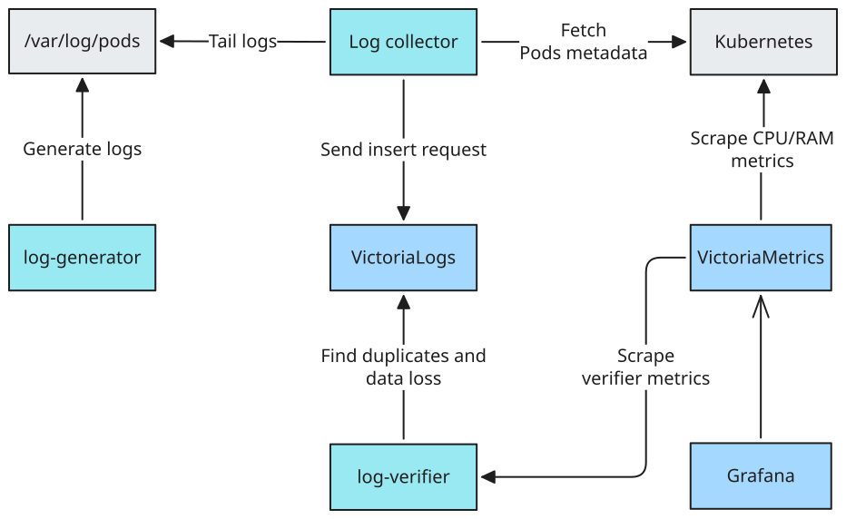

# Log Collectors Benchmark

A benchmark suite for comparing log collectors, with log delivery verification.

## Results

We measure collector performance periodically.
Results from the latest and previous runs are published here:

https://victoriametrics.github.io/log-collectors-benchmark/

For the original, untuned baseline results, see the blog post:

https://victoriametrics.com/blog/log-collectors-benchmark-2026/

## How does it work?

Runs in a local Kubernetes cluster (using `kind`).
Measures CPU/memory usage, throughput and missing logs per collector.

1. log-generator - generates JSON logs. See [Log format](https://victoriametrics.github.io/log-collectors-benchmark/#log-format) for details.
2. Log collector - tails logs from log-generator Pods, ships them to log-verifier.
3. log-verifier - receives logs directly from collectors, exposes delivery metrics.
4. VictoriaMetrics - stores metrics; vmagent - collects CPU/RAM metrics of containers and metrics from log-verifier.
5. Grafana - displays metrics and resource usage.

Simplified diagram:



See [Methodology](https://victoriametrics.github.io/log-collectors-benchmark/#methodology)
on the results page for how collectors are configured and compared.

### Verification

log-verifier implements a VictoriaLogs-compatible insert API,
so collectors ship logs directly to it without any additional configuration.

Each log produced by log-generator contains:

- `sequence_id` - a unique, monotonically increasing integer per Pod.
- `generated_at` - nanosecond timestamp of when the log was produced.

For each collector + Pod pair, log-verifier tracks:

- The maximum observed `sequence_id` (`log_verifier_max_sequence_id`).
- Total number of received logs (`log_verifier_logs_total`).
- End-to-end delivery latency (difference between `generated_at` and the time log-verifier received the log).

Since `sequence_id` starts at 1 and increments strictly by 1 for each log, the number of lost logs is:

```
sum(log_verifier_max_sequence_id - log_verifier_logs_total) by (collector)
```

> Note: The formula is valid as long as log-generator Pods are not restarted with the same name.
> A restart resets sequence_id to 1 while log_verifier_max_sequence_id retains its previous maximum,
> making the loss count invalid for that Pod. Deleting or replacing a Pod with a new name is fine.

All exposed metrics:

| Metric                                                                | Description                                            |
|-----------------------------------------------------------------------|--------------------------------------------------------|
| `log_verifier_max_sequence_id{collector, log_generator_pod}`          | Highest sequence ID received from a given Pod          |
| `log_verifier_logs_total{collector, log_generator_pod}`               | Total logs received from a given Pod                   |
| `log_verifier_delivery_latency_seconds{collector, log_generator_pod}` | End-to-end delivery latency histogram                  |
| `log_verifier_malformed_logs_total{collector, reason}`                | Logs dropped due to missing or invalid required fields |

These metrics are scraped by vmagent and visualized in Grafana.

## Reproduce locally

These binaries expected to be installed:
docker, kubectl, [`kind`](https://kind.sigs.k8s.io/), helm, make, go.

Ports `3000` (Grafana) and `8428` (VictoriaMetrics) must be free on the host.

Each collector requires at least 1 CPU and 1 GiB RAM to operate.

There are two ways to run this benchmark:

- Manual (recommended for a first look): deploys the whole stack at once, without producing any reports.
  Useful for debugging a collector while watching metrics live in Grafana:
  ```sh
  make bench-up-all
  ```
  Note: running all collectors at once requires a machine with at least 12 CPUs, 12 GiB RAM, and 200 GiB of disk space. <br>
  See [Manual setup](#manual-setup) if you then want to tune or deploy a single collector.

- Automated: runs every collector one-by-one to measure maximum throughput and resource usage,
  writes reports to `results/<date>/`, and renders the results page.
  This is how [the published results](https://victoriametrics.github.io/log-collectors-benchmark/) are produced.
  ```sh
  go run ./bench-runner
  go run ./bench-runner render > index.html
  ```
  Note: a full run takes ~10 hours in total. <br>
  See [Automated runs](#automated-runs) for details.

## Manual setup

Use these steps to deploy a single collector, tune its config, and
watch metrics live in Grafana.
`bench-up-all` runs steps 2-4 with default parameters for every collector at once.

### 1. (Optional) Switch to VictoriaLogs as the backend

By default, collectors ship logs directly to log-verifier. If you want to store logs in VictoriaLogs instead:

```sh
make set-endpoint VLS_HOST=victoria-logs-host VLS_PORT=9428
```

This rewrites the destination host and port across all collector configuration files at once.

> **Note**: When using VictoriaLogs as the backend, log-verifier no longer receives logs directly,
> so delivery metrics (`log_verifier_*`) will not be available in Grafana.

### 2. Deploy monitoring stack

Creates the `kind` cluster, deploys VictoriaMetrics, vmagent, log-verifier, and Grafana:

```sh
make bench-up-monitoring
```

### 3. Deploy collectors

```sh
make bench-up-collectors
```

> **Note**: Some collector images (e.g. Fluentd, Filebeat) are several gigabytes in size.
> The first run may take a while depending on your network speed.

To deploy a single collector instead:

```sh
make bench-up-vlagent                 # VictoriaLogs Agent
make bench-up-vector                  # Vector
make bench-up-promtail                # Promtail
make bench-up-alloy                   # Grafana Alloy
make bench-up-grafana-agent           # Grafana Agent
make bench-up-fluent-bit              # Fluent Bit
make bench-up-opentelemetry-collector # OpenTelemetry Collector
make bench-up-filebeat                # Filebeat
make bench-up-fluentd                 # Fluentd
```

### 4. Start log generator

```sh
make bench-up-generator RAMP_UP_STEP=5 RAMP_UP_STEP_INTERVAL=1s GENERATOR_REPLICAS=10
```

It will start 10 log-generator Pods.
Each will produce 5*10 logs/sec, and gradually increase by 5 logs/sec every second, independently per replica.

| Variable                | Default | Description                                  |
|-------------------------|---------|----------------------------------------------|
| `GENERATOR_REPLICAS`    | `10`    | Number of log-generator Pod replicas         |
| `LOGS_PER_SECOND`       | `10`    | Initial log throughput                       |
| `RAMP_UP`               | `true`  | Whether to gradually increase log throughput |
| `RAMP_UP_STEP`          | `5`     | Logs/sec added at each ramp-up step          |
| `RAMP_UP_STEP_INTERVAL` | `1s`    | How often to increase the load               |

### 5. Access Grafana dashboard

A Grafana dashboard is provisioned automatically during setup.
It visualizes collector performance, resource usage, and log delivery quality.

Open http://localhost:3000 (credentials: `admin`/`admin`) and navigate to the
`Log Collectors Benchmark` dashboard.

VictoriaMetrics is available at http://localhost:8428 if you want to query metrics directly.

### 6. Stop log generator

After the test completes (all collectors started losing logs), stop the generator:

```sh
make bench-down-generator
```

### 7. Change the load

To change the load, uninstall the existing log-generator, collectors,
and restart log-verifier to reset delivery metrics:

```sh
make bench-down-generator
make bench-down-collectors
kubectl rollout restart -n monitoring deployment/log-verifier
```

Wait a few minutes to separate different benchmarks from each other.
Deploy new collectors and log-generator Pods with the desired load:

```sh
make bench-up-collectors

make bench-up-generator RAMP_UP_STEP=1 RAMP_UP_STEP_INTERVAL=2s GENERATOR_REPLICAS=100
```

### 8. Clean up

This command deletes the `kind` cluster and all deployed resources, including the benchmark results:

```sh
make bench-down-all
```

## Automated runs

`bench-runner` automates the steps from [Manual setup](#manual-setup):
it deploys each collector one at a time, runs it through maximum throughput and resource usage benchmark cases,
and writes one JSON report per collector per case:

```sh
go run ./bench-runner
```

Results are written to `results/<date>/`.
If a report for a collector already exists for today, that collector is
skipped - delete the file to force a re-run.

To run a subset of collectors:

```sh
go run ./bench-runner -collectors=vlagent,vector
```

To render the results page from everything in `results/`:

```sh
go run ./bench-runner render > index.html
```

This is the same page published at
https://victoriametrics.github.io/log-collectors-benchmark/

## Contributing

Send a PR if you know how to make a collector faster or use less memory.
If we can reproduce the result, we re-run the benchmark and update the
[blog post](https://victoriametrics.com/blog/log-collectors-benchmark-2026/) with the new numbers and your config.

To keep the comparison fair:

- Use settings from the collector's docs or its Helm chart values. Pick ones you would set in production.
- Don't turn off work the other collectors do: CRI and JSON parsing, compression, or delivery guarantees.
- Keep the change small, so we can validate and merge it faster.

Feel free to change any officially documented setting, but only if it improves CPU, RAM or throughput
by more than 10% without making the other numbers worse.
